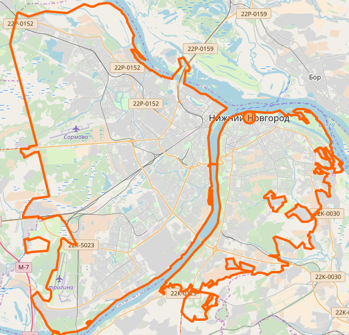
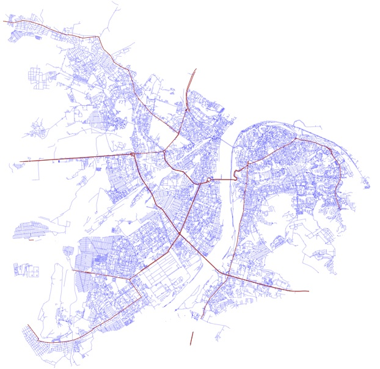

# OpenStreetMapGraph
Визуализация графа дорог Нижнего Новгорода
## Использование
**Необходим установленный Python 3.x! **
Также при запуске нужно будет установить недостающие пакеты

Для запуска построения визуализации необходимо выполнить команду:
```
python graph.py -s
```

Для проекции на плоскость использовался алгоритм Меркатора.

Для построения списка смежности необходимо добавить аттрибут ```-l```

Список всех возможных аттрибутов доступен по команде:
```
python graph.py -h
```
Также возможно построить матрицу смежности, но пока что этот процесс занимает слишком много времени, и выходной файл весит около 3GB.

Сравнение (исходное изображение, полученное):
 | 
(Коричневым отмечены главные дороги)

Все результаты (и файл с входными данными) (кроме матрицы смежности) доступны по ссылке: https://yadi.sk/d/4SqceBJl3TLooJ

## Алгоритмы поиска кратчайших путей и задача коммивояжера
Мною также были реализованы несколько алгоритмов поиска кратчайших путей. Для их тестирования необходимо ввести следующую команду:
```
python paths.py -имяАттриубута
```

Все доступные имена аттрибутов, в том числе для запуска решения задачи коммивояжера доступны по команде
```
python paths.py -h
```